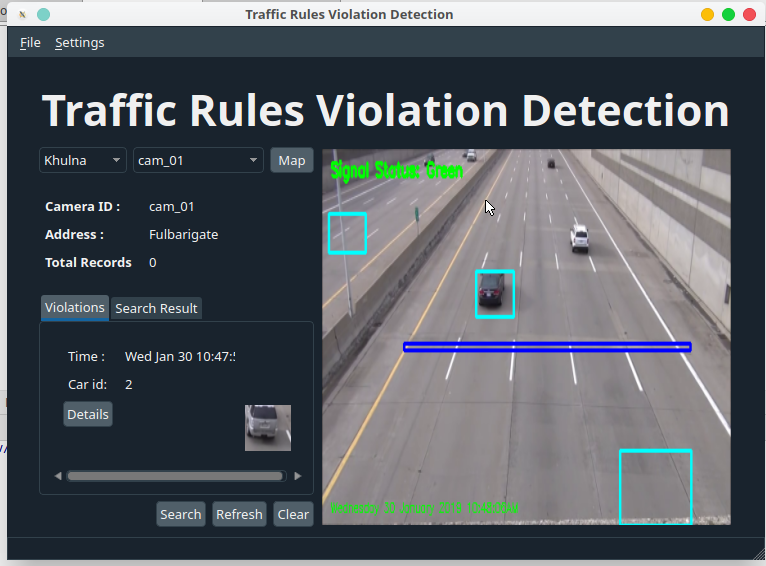

# IRISS Traffic Rules Violation Detection with Computer Vision




# Intelligent Road Inspection & Surveillance System (IRISS)


## Overview

IRISS (Intelligent Road Inspection & Surveillance System) is a state-of-the-art traffic management system designed to monitor and detect traffic signal violations and manage vehicle behavior. The system uses advanced computer vision and deep learning technologies to ensure accurate detection and reporting of traffic violations, with special considerations for emergency vehicles.

## Key Features

- **Traffic Signal Violation Detection**: Real-time detection of traffic signal violations such as running red lights.
- **Vehicle Tracking**: Monitors vehicles crossing predefined lines and tracks their direction and movement.
- **Emergency Vehicle Handling**: Excludes emergency vehicles from violation detection to avoid false positives.
- **Data Management**: Logs violation data including timestamps and images for analysis and reporting.
- **System Configuration**: Manage system settings and thresholds via API endpoints.

## Technologies Used

- **Computer Vision**: OpenCV for image processing and vehicle tracking.
- **Deep Learning**: TensorFlow for model inference and detection.
- **Database**: SQLlite for storing records and configurations.
- **Web Framework**: Flask (or similar) for API development.

## Installation

### Prerequisites

- Python 3.8 or higher
- SQLlite Database
- Required Python libraries (listed in `requirements.txt`)

### Setup

1. **Clone the Repository**

   ```bash
   git clone https://github.com/yourusername/iriss.git
   cd iriss
   ```

2. **Set Up the Environment**

   Create a virtual environment and install dependencies:

   ```bash
   python -m venv venv
   source venv/bin/activate  # On Windows use `venv\Scripts\activate`
   pip install -r requirements.txt
   ```

3. **Database Configuration**

   - Create a MySQL database and user.
   - Update the `config.py` file with your database credentials.

4. **Run Database Migrations**

   ```bash
   flask db upgrade
   ```

5. **Start the Application**

   ```bash
   flask run
   ```

## API Endpoints

### Authentication

- **POST /api/auth/login**
  - Authenticate and receive a JWT token.
  
### Violation Management

- **GET /api/violations**
  - Retrieve a list of all recorded violations.
  
- **GET /api/violations/{violation_id}**
  - Retrieve details of a specific violation.

### Vehicle Management

- **GET /api/vehicles**
  - Retrieve a list of registered vehicles.
  
- **POST /api/vehicles**
  - Register a new vehicle in the system.

### System Configuration

- **GET /api/config**
  - Retrieve the current system configuration.
  
- **PUT /api/config**
  - Update the system configuration.

### System Status

- **GET /api/status**
  - Retrieve the current status of the IRISS system.

## Usage

1. **Run the System**

   Start the system using the provided Flask server. Ensure your camera feeds are properly configured and connected.

2. **Access the API**

   Use API endpoints to interact with the system. Authentication is required for certain endpoints.

3. **Monitor and Manage**

   View and manage violations, vehicles, and system configurations through the API.

## Contributing

Contributions are welcome! Please refer to the [CONTRIBUTING.md](CONTRIBUTING.md) file for guidelines on how to contribute to the project.

## License

This project is licensed under the [MIT License](LICENSE).

## Contact

For questions or support, please contact nareshkumar.shanmugathas@gmail.com
